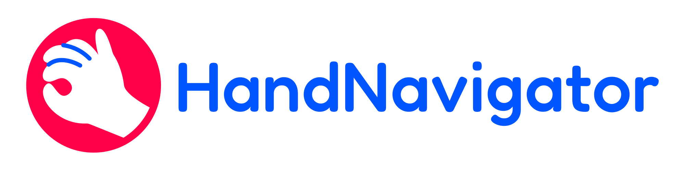

<p align="center">
  
</p>

<p align="center">
  <strong>Navegue em viewports 3D com as mãos. Sem hardware adicional.</strong><br/>
  Alternativa open-source ao 3Dconnexion SpaceMouse — powered by visão computacional.
</p>

<p align="center">
  
  
  
  
</p>

---

## O que é o HandNavigator?

HandNavigator transforma qualquer webcam padrão em um controlador de navegação 3D. Usando rastreamento de mão em tempo real, reconhece gestos naturais e os converte em movimentos de câmera — **Pan**, **Orbit** e **Zoom** — que funcionam dentro do Cinema 4D, Blender, Maya e praticamente qualquer aplicação 3D.

Sem dongles. Sem drivers. Sem hardware especial. Apenas suas mãos e uma webcam.

### Como funciona

1. Abra o HandNavigator ao lado do seu app 3D
2. A webcam rastreia sua mão usando machine learning (detecção de 21 pontos)
3. Gestos são reconhecidos em tempo real e traduzidos em navegação de câmera
4. A navegação é enviada ao seu app 3D via simulação de input nativa ou comunicação direta com o plugin

### Referência de Gestos

| Gesto                             | Ação      | Como                                |
| --------------------------------- | --------- | ----------------------------------- |
| Mão aberta + arrastar             | **Pan**   | Move a câmera lateralmente          |
| Pinça (polegar+indicador) + mover | **Zoom**  | Zoom in/out                         |
| Punho fechado + rotacionar        | **Orbit** | Rotaciona a câmera ao redor do alvo |
| Mão parada / fora do quadro       | Idle      | Sem ação                            |

---

## Primeiros Passos

### Opção A — Instalador (recomendado)

Baixe `HandNavigator_Setup_1.0.0.exe` na página de [Releases](../../releases). O instalador:

- Instala a aplicação desktop
- Detecta automaticamente instalações do Cinema 4D (2020–2030)
- Instala o plugin C4D em cada versão selecionada
- Opcionalmente adiciona inicialização automática com o Windows

### Opção B — A partir do código-fonte

**Requisitos:** Python 3.11+, Windows 10/11, webcam.

```bash
git clone https://github.com/YOUR_USER/HandNavigator.git
cd HandNavigator
pip install -r requirements.txt
python -m ui.app
```

O modelo de mão do MediaPipe (~25 MB) é baixado automaticamente na primeira execução.

### Plugin Cinema 4D

O instalador cuida disso automaticamente. Para instalação manual:

1. Copie a pasta `c4d_plugin/HandNavigator/` para o diretório de plugins do C4D
2. Ou vá em **Edit → Preferences → Plugins → Add Folder** e aponte para ela
3. Reinicie o Cinema 4D
4. Acesse via **Extensions → HandNavigator**

O plugin inclui um dashboard com status em tempo real, sliders de sensibilidade para cada eixo e controles de conexão. Maxon Plugin ID oficial: `1067724`.

### Aplicações Suportadas

| Aplicação       | Modo de Input       | Status                                    |
| --------------- | ------------------- | ----------------------------------------- |
| Cinema 4D       | Plugin UDP (direto) | Totalmente testado, plugin nativo incluso |
| Blender         | Win32 SendInput     | Pronto, perfil incluso                    |
| Maya            | Win32 SendInput     | Compatível (mesmos atalhos do C4D)        |
| Qualquer app 3D | Win32 SendInput     | Funciona via simulação de teclado/mouse   |

### Internacionalização

A UI detecta automaticamente o locale do seu SO e suporta:

- English (padrão)
- Português (Brasil)
- Español

---

## Documentação Técnica

> Esta seção é voltada para desenvolvedores que desejam entender, contribuir ou estender o HandNavigator.

### Arquitetura

```
                         ┌─────────────────────────────────────┐
                         │         HandNavigator Desktop       │
                         │                                     │
  Webcam ──► OpenCV ──►  │  MediaPipe Hand Landmarker (TFLite) │
                         │           │                         │
                         │  Gesture Recognizer (heurístico)    │
                         │           │                         │
                         │  Navigation Solver (engine de delta)│
                         │           │                         │
                         │    ┌──────┴───────┐                 │
                         │    │              │                 │
                         │  Win32        UDP Socket            │
                         │  SendInput    (pacotes JSON)        │
                         │    │              │                 │
                         └────┼──────────────┼─────────────────┘
                              │              │
                              ▼              ▼
                         Qualquer App   Plugin Cinema 4D
                         3D (via OS)    (GeDialog nativo)
```

### Stack

- **Linguagem:** Python 3.11
- **Rastreamento de Mão:** Google MediaPipe Tasks API — modelo de 21 landmarks, backend TFLite, inferência CPU a 30+ FPS
- **Visão Computacional:** OpenCV — captura de webcam, processamento de frames, conversão de espaço de cor
- **Framework GUI:** PyQt6 — janela principal, system tray, overlay PIP de webcam, viewport OpenGL
- **Renderização 3D:** PyOpenGL — modo Preview em tempo real com orbit/pan/zoom em grid de referência
- **Simulação de Input:** Win32 `SendInput` via ctypes — injeção de mouse/teclado sem dependências
- **Protocolo de Rede:** UDP sockets com payloads JSON — latência sub-ms para comunicação com plugin C4D
- **Suavização:** Implementação do One-Euro Filter — filtro passa-baixa adaptativo que equilibra supressão de jitter com responsividade
- **Integração C4D:** Cinema 4D Python API (módulo `c4d`) — plugin `CommandData`, UI `GeDialog`, servidor UDP em thread
- **Build:** PyInstaller 6.18 (EXE standalone), Inno Setup 6 (instalador Windows)
- **i18n:** Módulo de string-table customizado com detecção automática de locale (3 idiomas, 53 chaves)

### Mapa de Módulos

```
HandNavigator/
├── tracker/                  # Engine de rastreamento
│   ├── config.py             # Parâmetros ajustáveis (sensibilidade, dead zones, etc.)
│   ├── hand_detector.py      # Wrapper MediaPipe — lifecycle, extração de landmarks
│   ├── gesture_recognizer.py # Classificador heurístico (IDLE/PAN/ZOOM/ORBIT) + debounce
│   ├── navigation_solver.py  # Engine de cálculo de deltas — converte landmarks em deltas de câmera
│   ├── smoothing.py          # Implementação do One-Euro Filter (passa-baixa adaptativo)
│   └── main.py               # Orquestrador — loop de câmera, pipeline gesto→navegação
│
├── input/                    # Adaptadores de saída
│   ├── input_simulator.py    # Dispatcher baseado em perfil (seleciona Win32 ou UDP)
│   ├── win32_input.py        # Wrapper nativo SendInput (movimentos de mouse, botões, combos de tecla)
│   ├── c4d_socket_client.py  # Cliente UDP — serializa comandos de navegação como JSON
│   └── profiles/             # Mapeamentos de input por aplicação
│       ├── base_profile.py   # Contrato abstrato do perfil
│       ├── cinema4d.py       # Combos específicos C4D (Alt+MMB orbit, etc.)
│       └── blender.py        # Combos específicos Blender (MMB orbit, Shift+MMB pan)
│
├── ui/                       # Camada de aplicação desktop
│   ├── app.py                # Janela principal — troca de modo, barra de status, integração tray
│   ├── tray_icon.py          # System tray — ícone reativo a gestos, menu de contexto
│   ├── pip_widget.py         # Overlay PIP da webcam — frameless, arrastável, redimensionável
│   ├── viewport_3d.py        # Viewport OpenGL para modo Preview
│   ├── tracker_thread.py     # Wrapper QThread — roda loop de tracking fora da thread principal
│   └── i18n.py               # Internacionalização — tabelas de strings, detecção de locale
│
├── c4d_plugin/               # Plugin nativo Cinema 4D
│   └── HandNavigator/
│       ├── HandNavigator.pyp # Entry do plugin — GeDialog, servidor UDP, comandos de navegação
│       ├── LICENSE
│       └── README.md
│
├── assets/                   # Ícones do app (PNG, ICO, SVG)
├── models/                   # Modelo MediaPipe (auto-download, no gitignore)
├── HandNavigator.spec        # Configuração de build PyInstaller
├── installer.iss             # Script do instalador Inno Setup
└── requirements.txt          # Dependências Python
```

### Reconhecimento de Gestos (Detalhe)

O classificador de gestos em `gesture_recognizer.py` usa uma abordagem **heurística e determinística** — sem modelo ML secundário, sem dados de treinamento. A classificação é baseada em análise geométrica dos 21 landmarks do MediaPipe:

- **Detecção de pinça:** distância Euclidiana entre a ponta do polegar (landmark 4) e a ponta do indicador (landmark 8), normalizada pela escala da mão
- **Detecção de punho:** razão média de curvatura de todos os cinco dedos (distância ponta-MCP vs comprimento do dedo)
- **Mão aberta:** todos os dedos estendidos além do limiar de curvatura
- **Debounce:** um gesto deve persistir por `GESTURE_SWITCH_FRAMES` frames consecutivos antes de se tornar ativo, prevenindo alternância errática

### Pipeline de Suavização

Landmarks de mão brutos são inerentemente ruidosos. O HandNavigator aplica uma estratégia de **suavização em camadas duplas**:

1. **Suavização de landmarks** (One-Euro Filter por landmark) — aplicada antes da classificação de gestos para estabilizar o sinal de entrada
2. **Suavização de delta de navegação** — aplicada após o Navigation Solver para suavizar os comandos de saída
3. **Dead zones** — limiares mínimos configuráveis (`DEAD_ZONE_TRANSLATION`, `DEAD_ZONE_ROTATION`) abaixo dos quais o movimento é ignorado completamente

O One-Euro Filter é um filtro adaptativo que aumenta a suavização em baixas velocidades (reduzindo jitter) e a diminui em altas velocidades (preservando responsividade). Os parâmetros `min_cutoff` e `beta` são ajustados por caso de uso.

### Protocolo do Plugin C4D

O app desktop e o Cinema 4D se comunicam via UDP em `127.0.0.1:19700`. Pacotes são codificados em JSON com o seguinte schema:

```json
{
  "type": "orbit",
  "dx": 0.0023,
  "dy": -0.0011
}
```

Tipos de comando suportados: `orbit`, `pan`, `zoom`. O plugin aplica os deltas recebidos diretamente na matriz de transformação da câmera ativa usando a API Python do Cinema 4D.

### Configuração

Todos os parâmetros ajustáveis ficam em `tracker/config.py`:

```python
ACTIVE_PROFILE       = "cinema4d"   # Seleção de perfil
PAN_SENSITIVITY      = 800          # Pixels de mouse por unidade de movimento da mão
ZOOM_SENSITIVITY     = 1200         # Multiplicador de responsividade do zoom
ORBIT_SENSITIVITY    = 600          # Multiplicador de responsividade do orbit
DEAD_ZONE_TRANSLATION = 0.003      # Limiar mínimo de movimento
DEAD_ZONE_ROTATION   = 0.004       # Limiar mínimo de rotação
GESTURE_SWITCH_FRAMES = 3          # Frames necessários para confirmar mudança de gesto
SHOW_DEBUG_WINDOW    = True         # Mostrar overlay de debug da webcam
```

### Build a partir do Código-Fonte

**EXE standalone:**

```bash
pip install pyinstaller
python -m PyInstaller HandNavigator.spec --noconfirm --clean
# Output: dist/HandNavigator/HandNavigator.exe
```

**Instalador Windows** (requer [Inno Setup 6](https://jrsoftware.org/isinfo.php)):

```bash
# Primeiro faça o build do EXE, depois:
iscc installer.iss
# Output: installer_output/HandNavigator_Setup_1.0.0.exe
```

### Adicionando um Novo Perfil de Aplicação

1. Crie `input/profiles/seu_app.py` implementando `BaseProfile`
2. Defina os combos de tecla/mouse para orbit, pan e zoom
3. Registre em `input/profiles/__init__.py`
4. Defina `ACTIVE_PROFILE = "seu_app"` em `tracker/config.py`

Veja `input/profiles/cinema4d.py` como implementação de referência.

---

## Autor

**Flávio Takemoto** — [takemoto.com.br](http://www.takemoto.com.br)

## Licença

[MIT](LICENSE) — livre para uso pessoal e comercial.

---

## English

<details>
<summary><strong>Click to expand the English version</strong></summary>

### What is HandNavigator?

HandNavigator turns any standard webcam into a 3D navigation controller. Using real-time hand tracking, it recognizes natural gestures and converts them into camera movements — **Pan**, **Orbit**, and **Zoom** — that work inside Cinema 4D, Blender, Maya, and virtually any 3D application.

No dongles. No drivers. No special hardware. Just your hands and a webcam.

### How it works

1. Open HandNavigator alongside your 3D app
2. A webcam feed tracks your hand using machine learning (21-landmark detection)
3. Gestures are recognized in real time and translated to camera navigation
4. Navigation is sent to your 3D app via native input simulation or direct plugin communication

### Gesture Reference

| Gesture                    | Action    | How                         |
| -------------------------- | --------- | --------------------------- |
| Open hand + drag           | **Pan**   | Move camera laterally       |
| Pinch (thumb+index) + move | **Zoom**  | Zoom in/out                 |
| Closed fist + rotate       | **Orbit** | Rotate camera around target |
| Hand still / out of frame  | Idle      | No action                   |

### Getting Started

#### Option A — Installer (recommended)

Download `HandNavigator_Setup_1.0.0.exe` from the [Releases](../../releases) page. The installer:

- Installs the desktop application
- Auto-detects Cinema 4D installations (2020–2030)
- Installs the C4D plugin into each selected version
- Optionally adds auto-start with Windows

#### Option B — From source

**Requirements:** Python 3.11+, Windows 10/11, webcam.

```bash
git clone https://github.com/YOUR_USER/HandNavigator.git
cd HandNavigator
pip install -r requirements.txt
python -m ui.app
```

The MediaPipe hand model (~25 MB) is auto-downloaded on first run.

### Cinema 4D Plugin

The installer handles this automatically. For manual installation:

1. Copy the `c4d_plugin/HandNavigator/` folder to your C4D plugins directory
2. Or go to **Edit → Preferences → Plugins → Add Folder** and point to it
3. Restart Cinema 4D
4. Access via **Extensions → HandNavigator**

The plugin includes a dashboard with real-time status, sensitivity sliders for each axis, and connection controls. Official Maxon Plugin ID: `1067724`.

### Supported Applications

| Application | Input Mode          | Status                               |
| ----------- | ------------------- | ------------------------------------ |
| Cinema 4D   | UDP plugin (direct) | Fully tested, native plugin included |
| Blender     | Win32 SendInput     | Ready, profile included              |
| Maya        | Win32 SendInput     | Compatible (shares C4D shortcuts)    |
| Any 3D app  | Win32 SendInput     | Works via keyboard/mouse simulation  |

### Author

**Flávio Takemoto** — [takemoto.com.br](http://www.takemoto.com.br)

### License

[MIT](LICENSE) — free for personal and commercial use.

</details>
